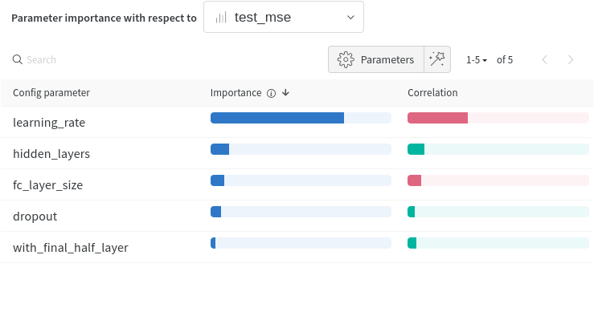
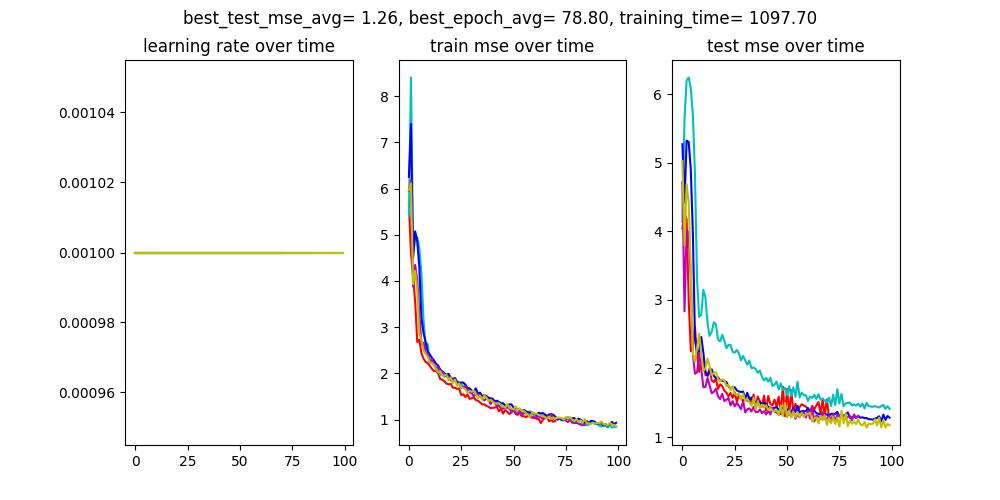

# Novozymes enzymes stability predictions

<!-- vscode-markdown-toc -->

- 1. [Code Structure](#CodeStructure)
- 2. [Protein mutation stability](#Proteinmutationstability)
- 3. [Data](#Data)
- 4. [Features](#Features)
- 5. [First results](#Firstresults)
  - 5.1. [Simple Neural Network](#SimpleNeuralNetwork)
    - 5.1.1. [Parameters importance](#Parametersimportance)
    - 5.1.2. [Learning curve](#Learningcurve)
    - 5.1.3. [Hyper parameters tuning](#Hyperparameterstuning)
- 6. [Hybrid model](#Hybridmodel)
- 7. [XGBoost](#XGBoost)
- 8. [Other](#Other)
- 9. [Resources:](#Resources:)
- 10. [Dependencies](#Dependencies)
- 11. [Virtual environment](#Virtualenvironment)

<!-- vscode-markdown-toc-config
	numbering=true
	autoSave=true
	/vscode-markdown-toc-config -->
<!-- /vscode-markdown-toc -->

[Kaggle competition overview page](https://www.kaggle.com/competitions/novozymes-enzyme-stability-prediction/overview)

## 1. Code Structure

- The project is constituted for the most part of jupyter notebooks and python scripts aimed at creating a global dataset which merges multiple source of experimental data for both ddG and dTm values, all linked to protein mutations.
- Therefore at the root of the project there are 6 jupyter notebooks aimed at using the experimental results that can be found online and are locally stored in data/ (see [data sources.csv](data/sources.csv)).
- The output of the jupyter notebooks at the root of the project will then be stored in a folder in data/main_dataset_creation/outputs/.
- In order to compute the different features used we need to have the 3D structures (we use alphafold2 predicted structures), but also the relaxed structure computed with the rosetta software (The purpose of Rosetta's relax mode is to lower the energy of a structure by making small adjustements to the backbone and sidechain torsion angles) for both wild and mutated protein sequences. The code to do this is in [compute_mutated_structures](compute_mutated_structures/)
  - This computation of the mutated structure is quite heavy, I ended up using free Google Cloud Platform credits to do it on a 32 vCPUs machine.
- Finally the code in the [training folder](training/) notably [the train notebook](training/train.ipynb) use the dataset with features from data/main_dataset_creation and the computed 3D structures in compute_mutated_structures (in the case of a cnn_only or hybrid model) to both train a model, compute the learning curve and compute the submission results.
- In order to configurate the training 2 distinct config files exist in training/:
  - [config_xgboost.json](training/config_xgboost.json)
  - [config_hybrid_nn.json](training/config_hybrid_nn.json)
- Those config files allow the user to specify all important aspect relative to the model training, such as:
  - the model type: xgboost or one of [hybrid, cnn_only, regression_only]
  - various model specifications (fully connected layer size etc.)
  - the dataset version & the features to use
  - the number of kfold, the use of a cuda device or not etc.
- Each training is logged (with results, graphs and models+scaler if specified) in training/outputs
- In order to do hyperparameter tuning we used wandb for visualization and optuna (or wandb sweep) for finding optimums.

---

2. Protein mutation stability

## 2. Protein mutation stability

Novozyme (company behind competition): produce enzymes for industry

Proteins are what makes everything work in a cell/bacteria/yeast : they move stuff, capture stuff, assemble stuff, break down stuff. (Enzymes are proteins with catalyzing abilities.)

Proteins are created by assembling Amino Acids, they then usually fold in order to be efficient.
By protein stability we mean < **stability** (not chemical) ie. is the protein in the right 3D state to be effective. When temperature becomes too high the protein “melt” ⇒ becomes unstable/denatured.

Proteins can be **modified**, meaning we can change their amino acid composition, in order to obtain new functionalities. But **those mutations also have an impact on the stability** of the protein**.**

**The goal is to be able to give the difference in stability of a protein for any mutation.**

Example: I changed the amino acid on position 14 from Glycine to Alanine, is the protein going to be more or less stable ? = What is the new melting temperature.

- We use ΔΔG as the measure of stability (Δ of free Gibson energy) goal: we change Glycine to Alanine, what is the ΔΔG of this mutation.
- We can also use ΔTm, which is the difference in melting temperature (Tm) of a mutation

---

3. Data

## 3. Data

There a some data available that link protein mutation with a measure of stability change (ΔΔG, ΔTm). I got ~10k distinct measure, from which ~7k got at least ΔΔG, and ~3k have only ΔTm.

⇒ That’s a **low** quantity of data, some people in the competition got more, but I checked and I think they got duplicates, and no one seems to have 20k+ measures.

⇒ Some dataset are manually curated, some are not, 10k is the number with **all** data (including not curated)

**🧠 idea:** I got ~1k data with both ΔΔG and ΔTm, maybe I could have a model that takes features+ΔTm and outputs ΔΔG ⇒ this could give me 3k more measures.

---

4. Features

## 4. Features

In order to merge all different dataset I got:

- the protein unique identifier (sometimes after looking at a not so unique identifier, or sequence)
- the measure (ΔΔG, ΔTm or just Tm)
- the associated pH of the experiment
- the mutation position
- the mutated amino acid

Then based on the unique protein id I went on to collect data on the protein (sequence) and the 3D structure (as predicted by alphafold).
And then I computed a bunch of features based on the sequence and the 3D structure. (I did compute an approximation of each mutated protein 3D structure based on the mutation position/amino acid and the alphafold.

3D alphafold

3D “relaxed”

3D ‘relaxed mutated”

**Notable Feature categories**:

- **ESM embeddings**: model (transformer) that takes protein sequence and tells stuff about it, already trained, we do an inference and keep the last layer (~ 1200 parameters) we then do a PCA to reduce the number to 32 (pool) and 16 (for wild and mutant + we compute the Δ between the 2)
- **Rosetta Scores:** tool that takes a 3D structure model and gives a score related to the stability
- **ThermoNet:** Convolutional model that takes both wild and mutated 3D models (in reality voxel representation of the models) and outputs ΔΔG ⇒ supposed to have **1 RMSE** on ΔΔG, **got 8 MeanSquarredError ~3** ΔΔG (kcal/mol) **RootMSE** ❓❓⇒ trained again (small change in 3D models) on my own dataset.
- **DeMaSk:** score based on the known proteins that look similar to ours, it takes our protein sequence, look at all sequences that looks the same, and tell us that at position 25 amino acid Gly is very frequent in sequence that look the same
- **3D structure analysis:** we look at the 3D structure and can say that this atom is in the center of the structure or close from the outside of it + other factors, again we computed those features on both the wild and mutated structure, and then computed the delta of it as well.

- Right now I have the following features:
    

        
Features

        - identification:
            uniprot
            dataset_source
            alphafold_path
            wild_aa
            mutated_aa
        - basics:
            wild_aa_int
            mutated_aa_int
            mutated_chain_int
            mutation_position
            length
            chain_start
            chain_end
            sequence
            pH
        - blosum:
            blosum62
            blosum80
            blosum90
            blosum100
        - demask (direct & indirect):
            demask_entropy
            demask_log2f_var
            demask_matrix
            demask_score
        - protein_analysis (wild, mutated, Δmutation):
            aromaticity
            charge_at_pH
            flexibility
            gravy
            helix_fraction
            isoelectric_point
            instability_index
            molecular_weight
            molar_extinction_1
            molar_extinction_2
            sheet_fraction
            turn_fraction
        - 3D_structure_analysis (alphafold, wild, mutated, Δ mutation):
            sasa
            residue_depth
            c_alpha_depth
            bfactor
        - dssp_3D_analysis (alphafold, wild, mutated, Δ mutation):
            Secondary_structure
            Relative_ASA
            Phi
            Psi
            NH->O_1_relidx
            NH->O_1_energy
            O->NH_1_relidx
            O->NH_1_energy
            NH->O_2_relidx
            NH->O_2_energy
            O->NH_2_relidx
            O->NH_2_energy
        - rosetta_scores (wild, mutated, Δ mutation):
            dslf_fa13
            fa_atr
            fa_dun
            fa_elec
            fa_intra_rep
            fa_intra_sol_xover4
            fa_rep
            fa_sol
            hbond_bb_sc
            hbond_lr_bb
            hbond_sc
            hbond_sr_bb
            linear_chainbreak
            lk_ball_wtd
            omega
            overlap_chainbreak
            p_aa_pp
            pro_close
            rama_prepro
            ref
            yhh_planarity
            total_score
        - esm_pca_pool:
            esm_pca_pool_0 to esm_pca_pool_31
        - esm_pca_wild:
            esm_pca_wild_0 to esm_pca_wild_15
        - esm_pca_mutant:
            esm_pca_mutant_0 to esm_pca_mutant_15
        - Δ esm_pca_local:
            esm_pca_local_0 to esm_pca_local_15
        - esm_global:
            esm_mutation_probability
            esm_mutation_entropy
        - target:
            ddG
            dTm
            Tm

    

  

---

5. First results

## 5. First results

### 5.1. Simple Neural Network

We take some (not all) features, we put them in a NN and see what happens.

We have a 5 splits of the data, meaning that for predictions we compute the avg of the 5 models trained on each split.

Results:

- Obtained with the following model structure:

  - Linear(131, 64)
  - ReLU
  - Dropout(0.25)
  - Linear(64, 64)
  - ReLU
  - Dropout(0.25)
  - Linear(64,2)
  - Linear(**2**,1)

- can reach an avg mse of ~3 MSE with ΔΔG as a target (so rmse of ~1.7).
- on Kaggle obtains a spearman rank of 0.42

⇒ normalize before mse

#### 5.1.1. Parameters importance

- top 10 parameters:
  - esm_pca_pool_1: 1.33
  - mutation_fa_intra_rep: 1.14
  - esm_pca_pool_19: 1.08
  - mutation_NH->O_1_relidx: 1.03
  - esm_pca_pool_4: 0.96
  - pH: 0.84
  - esm_pca_pool_2: 0.84
  - mutation_fa_rep: 0.79
  - mutation_pro_close: 0.70
  - esm_pca_pool_26: 0.67

⇒ There seem to have a bunch of unused features, even though I know some of them can be relevant

#### 5.1.2. Learning curve

#### 5.1.3. Hyper parameters tuning

I tried different neural network structure, and then ended up doing some sweep.
The graph show that is mostly random, at first I thought this was due to the fact that the ksplit was giving very different result, but after fixing it I still end up with what looks mostly random.

- graph
  
- parameters importance
  
- test mse v created
  
- test_mse(epochs)
  
- train_mse(epochs)
  
- loss(epochs)
  

 

---

6. Hybrid model

## 6. Hybrid model

To try and improve our result we tried to use both a CNN model able to learn from the voxel representation of the 3D structure from the protein (before and after mutation) in the same way as ThermoNet, and then in a later step add the computed features (such as blosum, demask, dssp etc.) to the "features" from the last layer of the CNN. We then concatenate those features together and put it through a regression model.

We attained better result than with cnn only or regression only (the code allow different model type to be trained, by simply specifying the model_type in the config file, "cnn_only" will trained a model very close to the one from ThermoNet, "regression_only" will not use voxel at all).

  

  
Hybrid model structure

  see [models.py](training/training_utils/models.py)
  
  - cnn_model: Sequential,
    - 0: Conv3d14, 16, kernel_size=3, 3, 3, stride=1, 1, 1,
    - 1: ReLU,
    - 0: Conv3d16, 24, kernel_size=3, 3, 3, stride=1, 1, 1,
    - 1: ReLU,
    - 0: Conv3d24, 32, kernel_size=3, 3, 3, stride=1, 1, 1,
    - 1: ReLU,
    - 0: Conv3d32, 48, kernel_size=3, 3, 3, stride=1, 1, 1,
    - 1: ReLU,
    - 0: Conv3d48, 78, kernel_size=3, 3, 3, stride=1, 1, 1,
    - 1: ReLU,
    - 1: MaxPool3dkernel_size=2, 2, 2, stride=2, 2, 2, padding=0, dilation=1, ceil_mode=False,
    - 2: Flattenstart_dim=1, end_dim=-1,
    - 0: Dropoutp=0.3, inplace=False,
    - 1: Linearin_features=2106, out_features=32, bias=True,
    - 2: ReLU,
    - 3: Dropoutp=0.3, inplace=False,
  - regression_model: Sequential,
    - 0: Flattenstart_dim=1, end_dim=-1,
    - 1: Linearin_features=182, out_features=256, bias=True,
    - 2: ReLU,
    - 3: Dropoutp=0.5, inplace=False,
    - 4: Linearin_features=256, out_features=256, bias=True,
    - 5: ReLU,
    - 6: Dropoutp=0.5, inplace=False,
    - 7: Linearin_features=256, out_features=256, bias=True,
    - 8: ReLU,
    - 9: Dropoutp=0.5, inplace=False,
    - 10: Linearin_features=256, out_features=256, bias=True,
    - 11: ReLU,
    - 12: Dropoutp=0.5, inplace=False,
    - 13: Linearin_features=256, out_features=128, bias=True,
    - 14: ReLU,
    - 15: Dropoutp=0.5, inplace=False,
    - 16: Linearin_features=128, out_features=1, bias=True,
  
  

---

7. XGBoost

## 7. XGBoost

In the same way that we can switch between CNN_only, regression_only or hybrid for the model type, we can also choose "xgboost"
This is similar to the regression only, only this time implemented with an optimized distributed gradient boosting model instead of a neural network.

[xgboost documentation](https://xgboost.readthedocs.io/en/stable/)

The xgboost outperforms slightly the regression_only neural network model in the leaderboard, although it does not outperform an hybrid model.

---

8. Other

## 8. Other

- max ddG & dTm values: most mutations are destabilizing (meaning <0 ddG or dTm values) therefore in order to have the best leaderboard result we focus on those by specifying in the training config files a max value for ddG and dTm. We also select only protein with a max length of 600 (the submission protein has a length of 220 amino acids)
- [Principal component analysis (PCA)](https://en.wikipedia.org/wiki/Principal_component_analysis) is a method implemented in this project to reduce the number of features in order to avoid overfitting to the dataset (keep in mind we only have ~400 proteins in our dataset, the new protein for submission is different from those)
- **missing values of ddG or dTm in the dataset** and **multi ouptut models**. Because the dataset is the result of merging different experimental results together, some mutations have a ddG value, some dTm, and some both. I did try to use ddG as a feature in order to predict dTm (or vice versa) but the average error was too important in order to augment my dataset. Another thing I tried in the neural networks was too have 2 targets (ddG and dTm) and compute a loss on the available data. But the result was not better than a training on ddG or dTm only.

---

9. Resources

## 9. Resources:

See the Notion export in resources/ for more infos

Some additionnal prediction of protein folding were done using [alphafold notebook](https://colab.research.google.com/github/deepmind/alphafold/blob/main/notebooks/AlphaFold.ipynb#scrollTo=woIxeCPygt7K)

---

10. Dependencies

## 10. Dependencies

Some features are computed using msms, see [this link for download](https://ccsb.scripps.edu/msms/downloads/), as well as [mgltools from the same authors](https://ccsb.scripps.edu/mgltools/downloads/). See [ssbio on how to install msms](https://ssbio.readthedocs.io/en/latest/instructions/msms.html)

Some features are computed using DeMaSK, see their [README](https://github.com/Singh-Lab/DeMaSk)
DeMaSK itself is dependent on [Blastp](https://ftp.ncbi.nlm.nih.gov/blast/executables/blast+/LATEST/) and [UniRef90 in fasta format](https://www.uniprot.org/help/downloads)

Some features are computed using [DSSP](https://swift.cmbi.umcn.nl/gv/dssp/) which stands for Define Secondary Structure of Proteins, it is the standard method for assigning secondary structure to the amino acids of a protein, given the atomic-resolution coordinates of the protein. See the [ssbio wiki](https://ssbio.readthedocs.io/en/latest/instructions/dssp.html) as well.
https://biopython.org/docs/1.76/api/Bio.PDB.DSSP.html

Voxel representations of relaxed 3D structure are computed using [acellera htmd](https://software.acellera.com/htmd/installation.html#installing-htmd), in a conda environment.

cuML is used for PCA, see the [git repo](https://github.com/rapidsai/cuml)

---

11. Virtual environment

## 11. Virtual environment

This project use pipenv to handle the dependencies, although in some devices (notably GCP compute engine) the installation of pytorch was done directly.
[See pipenv documentation](https://pipenv.pypa.io/en/latest/)
See the dependencies sections for more infos on package outside the pipenv.

